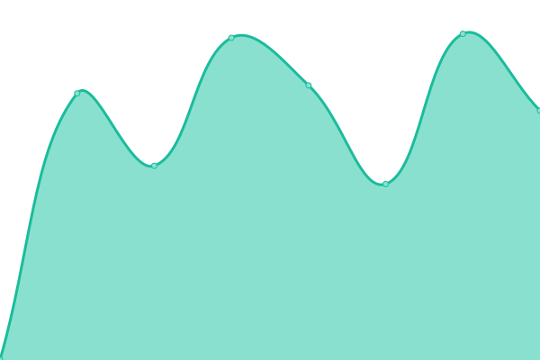
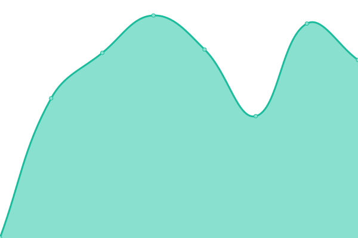

# [📈 Live Status](https://up.webzaytsev.ru): <!--live status--> **🟩 All systems operational**

This repository contains the open-source uptime monitor and status page for [WEBZaytsev](https://webzaytsev.ru/), powered by [Upptime](https://github.com/upptime/upptime).

With [Upptime](https://upptime.js.org), you can get your own unlimited and free uptime monitor and status page, powered entirely by a GitHub repository. We use [Issues](https://github.com/WEBzaytsev/upzaytsev/issues) as incident reports, [Actions](https://github.com/WEBzaytsev/upzaytsev/actions) as uptime monitors, and [Pages](https://up.webzaytsev.ru) for the status page.

<!--start: status pages-->
<!-- This summary is generated by Upptime (https://github.com/upptime/upptime) -->
<!-- Do not edit this manually, your changes will be overwritten -->
<!-- prettier-ignore -->
| URL | Status | History | Response Time | Uptime |
| --- | ------ | ------- | ------------- | ------ |
|  [WEBZaytsev](https://webzaytsev.ru) | 🟩 Up | [web-zaytsev.yml](https://github.com/WEBzaytsev/upzaytsev/commits/HEAD/history/web-zaytsev.yml) | 

 496ms
     
 | 

<a href="https://up.webzaytsev.ru/history/web-zaytsev">99.56%</a>
    

|  [GetCannab](https://getcannab.com) | 🟩 Up | [get-cannab.yml](https://github.com/WEBzaytsev/upzaytsev/commits/HEAD/history/get-cannab.yml) | 

 1381ms
     
 | 

<a href="https://up.webzaytsev.ru/history/get-cannab">100.00%</a>
    

|  [Guru.study](https://guru.study) | 🟩 Up | [guru-study.yml](https://github.com/WEBzaytsev/upzaytsev/commits/HEAD/history/guru-study.yml) | 

 870ms
     
 | 

<a href="https://up.webzaytsev.ru/history/guru-study">100.00%</a>
    

|  [Media ZZAPUSK](https://media.zzapusk.com) | 🟩 Up | [media-zzapusk.yml](https://github.com/WEBzaytsev/upzaytsev/commits/HEAD/history/media-zzapusk.yml) | 

 3344ms
     
 | 

<a href="https://up.webzaytsev.ru/history/media-zzapusk">99.43%</a>
    

|  [CondiPRO](https://bestsurprise.ru) | 🟩 Up | [condi-pro.yml](https://github.com/WEBzaytsev/upzaytsev/commits/HEAD/history/condi-pro.yml) | 

 1438ms
     
 | 

<a href="https://up.webzaytsev.ru/history/condi-pro">100.00%</a>
    

|  [Soken](https://soken.io) | 🟩 Up | [soken.yml](https://github.com/WEBzaytsev/upzaytsev/commits/HEAD/history/soken.yml) | 

 670ms
     
 | 

<a href="https://up.webzaytsev.ru/history/soken">100.00%</a>
    

<!--end: status pages-->

[**Visit our status website →**](https://up.webzaytsev.ru)

## 📄 License

- Powered by: [Upptime](https://github.com/upptime/upptime)
- Code: [MIT](./LICENSE) © [WEBZaytsev](https://webzaytsev.ru/)
- Data in the `./history` directory: [Open Database License](https://opendatacommons.org/licenses/odbl/1-0/)
